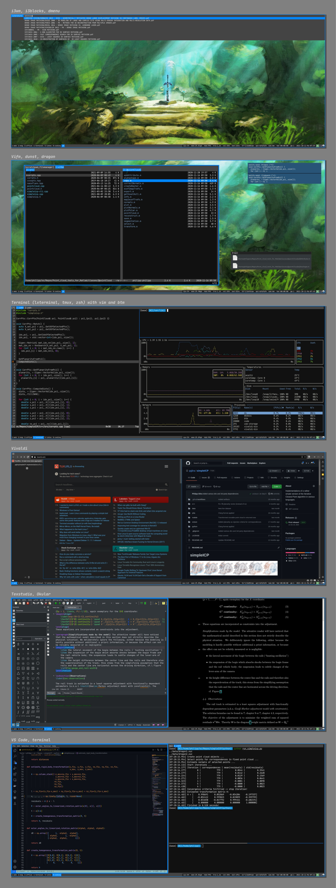

# dotfiles

Just my dotfiles. Feel free to use them.

- **Operating system**: mostly Ubuntu
- **WM**: [i3](https://i3wm.org/) (with [i3blocks](https://github.com/vivien/i3blocks))
- **Shell**: zsh
- **Terminal**: [lxterminal](https://wiki.lxde.org/de/LXTerminal) (with [tmux](https://github.com/tmux/tmux))
- **Text editors**: [vim](https://www.vim.org/) and [vscode](https://code.visualstudio.com/)
- **File manager**: [vifm](https://vifm.info/)
- **IDE**: [clion](https://www.jetbrains.com)
- **Video player**: [mpv](https://mpv.io/)
- **Image viewer**: [vimiv](https://github.com/karlch/vimiv-qt)
- **PDF viewer**: [okular](https://okular.kde.org/)

Programs I don't use anymore are moved to [``.archive``](.archive).

I use the shell scripts [``install-all-dots.sh``](install-all-dots.sh) and [``install-program-dots.sh``](install-program-dots.sh) to install my dotfiles across various PCs.

Some screenshots:

Works on my machine ¯\\\_(ツ)_/¯